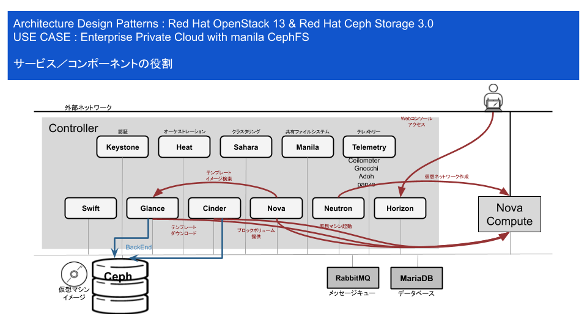
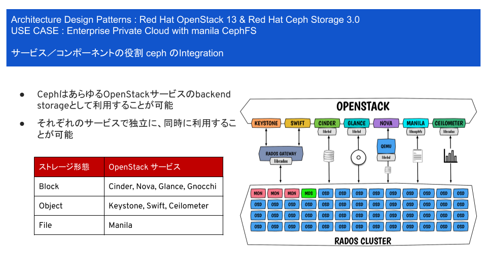
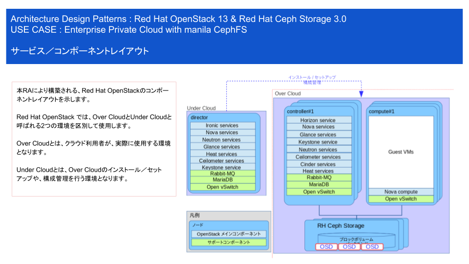
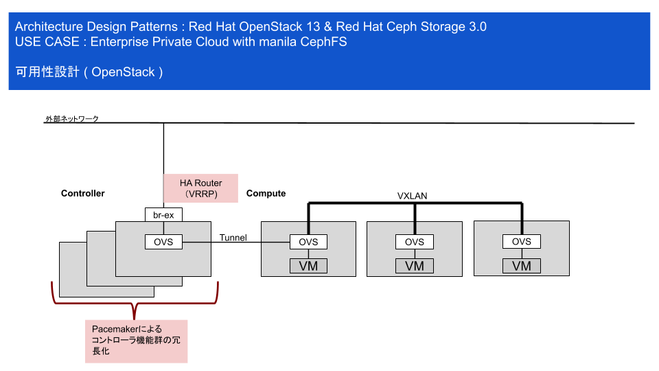
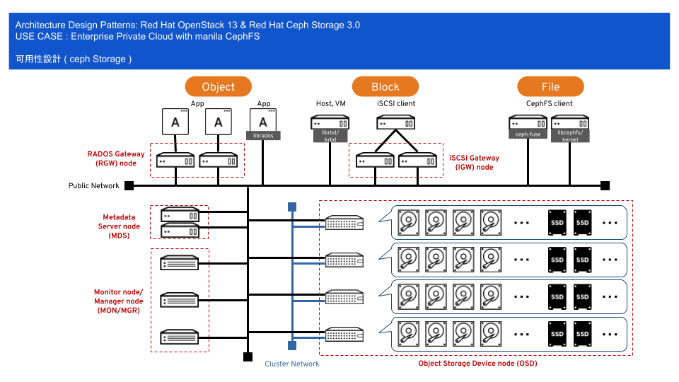
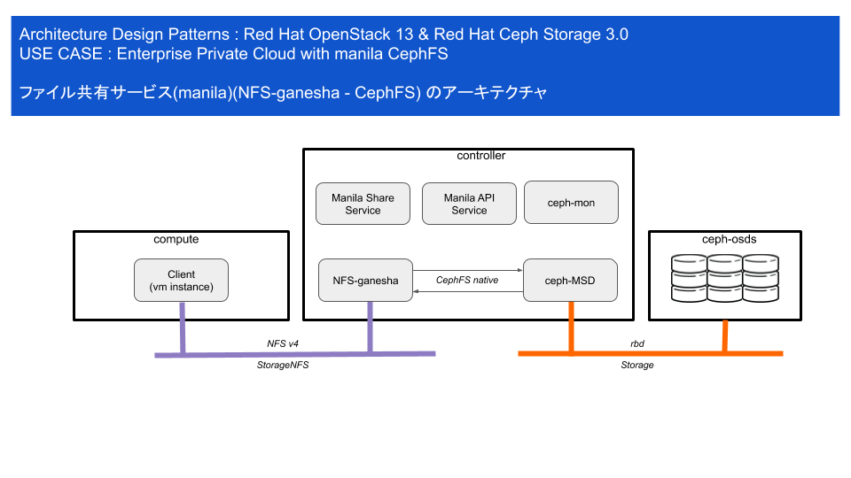
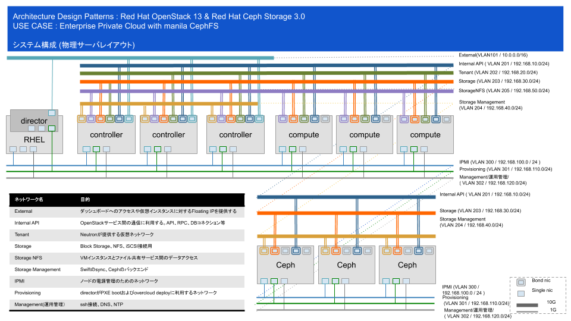
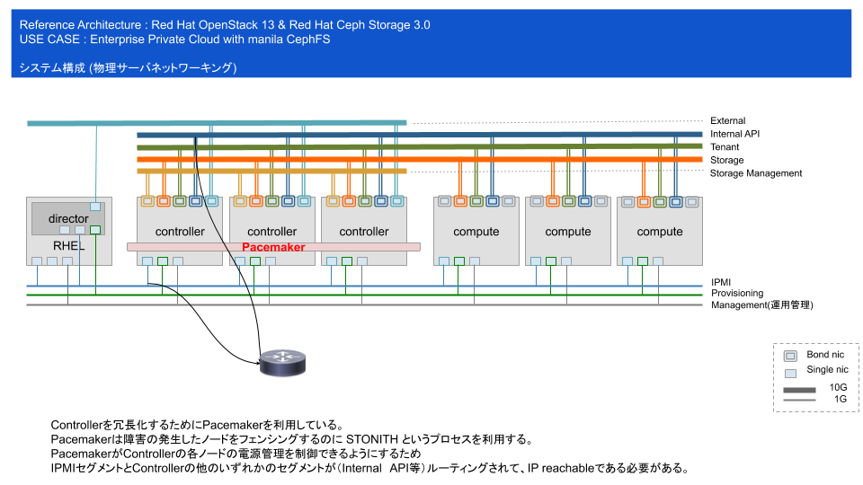
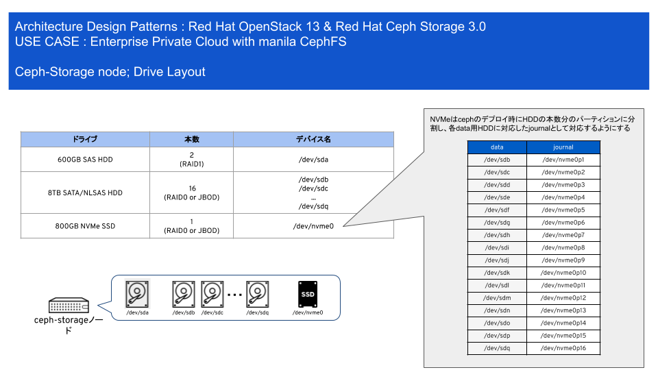

# 企業プライベートIaaS ファイル共有サービス(CephFS NFS-ganesha) （設計編）

## Red Hat OpenStack & ceph Storage 構成 考え方

### サービス／コンポーネントの役割

 

### サービス／コンポーネントの役割 ceph のintegration

 

### サービス／コンポーネントレイアウト

 

### サーバの役割

OpenStack 環境には、役割／用途に応じて、物理サーバを用意します。また、利用用途やワークロード特性に応じて、役割をカスタマイズすることができます。本ドキュメントでは、製品標準の構成を採用しています。以下に、サーバの役割を示します。

| サーバ名称 | 役割の説明 |
| :--------: | :--------- |
| 仮想ホスト | KVM仮想化環境を提供するホスト|
| Director | OpenStack 環境の構成管理を行うホスト。本構成では、仮想ホスト上に、ゲストVMとして構築 |
| Controller | 各種OpenStack のAPI機能 を集約するサーバ。 また、テナント仮想ルータは、Controllerに配置されるため、  テナント内部の通信は、Controller ノードを経由して、外部のネットワークへアクセスすることとなる。|
| Compute | ゲストVMが起動するサーバ。 |
| ceph storage | ceph storge のosd（データストア部）を配置するサーバ |

### ソフトウェアバージン／リポジトリ情報

本ドキュメントに示した環境を構築する前提となるソフトウェアのリリースバージョン及び、サブスクライブするリポジトリは、以下となります。

| サーバ名称 | ソフトウェア | RHN リポジトリ名称 | バージョン | SKU |
| :--------: | :-------------------- | :---------------- | :-----: |:-----: |
| 仮想ホスト | * Red Hat Enterprise Linux 7.5 | * rhel-7-server-rpms  | XXXXX | xxxx |
|  |   | * rhel-7-server-extras-rpms |  | |
|  |   | * rhel-7-server-rh-common-rpms |  | |
| Director | * Red Hat Enterprise Linux 7.5 | * rhel-7-server-rpms | XXXXX | xxxx |
|  |   | * rhel-7-server-extras-rpms |  | |
|  |   | * rhel-7-server-rh-common-rpms |  | |
|  |   | * rhel-ha-for-rhel-7-server-rpms |  | |
|  | * Red Hat OpenStack Platform 13  | * rhel-7-server-openstack-13-rpms |  | |
|  | * Red Hat Ceph Storage 3.0  | * rhel-7-server-rhceph-3-tools-rpms |  | |
| Controller | * Red Hat Enterprise Linux 7.5 | * rhel-7-server-rpms | XXXXX | xxxx |
|  |   | * rhel-7-server-extras-rpms |  | |
|  |   | * rhel-7-server-rh-common-rpms |  | |
|  |   | * rhel-ha-for-rhel-7-server-rpms |  | |
|  | * Red Hat OpenStack Platform 13  | * rhel-7-server-openstack-13-rpms |  | |
|  | * Red Hat Ceph Storage 3.0  | * rhel-7-server-rhceph-3-mon-rpms |  | |
|  |   | * rhel-7-server-rhceph-3-tools-rpms |  | |
| Compute | * Red Hat Enterprise Linux 7.5 | * rhel-7-server-rpms | XXXXX | xxxx |
|  |   | * rhel-7-server-extras-rpms |  | |
|  |   | * rhel-7-server-rh-common-rpms |  | |
|  | * Red Hat OpenStack Platform 13  | * rhel-7-server-openstack-13-rpms |  | |
|  | * Red Hat Ceph Storage 3.0  | * rhel-7-server-rhceph-3-tools-rpms |  | |
| ceph storage | * Red Hat Enterprise Linux 7.5 | * rhel-7-server-rpms | XXXXX | xxxx |
|  |   | * rhel-7-server-extras-rpms |  | |
|  |   | * rhel-7-server-rh-common-rpms |  | |
|  | * Red Hat Ceph Storage 3.0  | * rhel-7-server-rhceph-3-osd-rpms |  | |

### OpenStack 可用性の考え方

 

### ceph Storage の可用性の考え方

 

### manila ( CephFS NFS-ganesha ) のアーキテクチャ

  * Client(vmインスタンス)から、共有ボリュームへのアクセスは、NFS v4 を使用する
  * NFS-ganesha は、NFS リクエストを、CephFS native に変換し、ceph-MSD へ転送する
  * ceph-MSD は、RBD で、ceph-OSD 上のデータへアクセスする。

 

## Red Hat OpenStack & ceph Storage 構成 環境設計

### システム構成（物理サーバレイアウト)

 

### システム構成（物理サーバネットワーキング)

 

#### ネットワーク構成

| セグメント名 | VLAN ID | Network CIDR | 10G or 1G | 冗長化 | 説明 | director | controller | compute | ceph storage |
| :----------: | :-----: | :---------: | :----: | :------: | :------ | :-----: | :-----: | :-----: | :-----: |
| External | 101 | 10.0.0.0/16 | 1G | ◯ | ダッシュボードへのアクセスや仮想インスタンスに対するFloating IPを提供する | ◯ | ◯ | - | - |
| Internal API | 201 | 192.168.10.0/24 | 1G | ◯ | OpenStack サービス間の内部通信に使用する。内部APIアクセス、RPC 、DBコネクション等 | - | ◯ | ◯ | ◯ |
| Tenant | 202 | 192.168.20.0/24 | 10G | ◯ | クラウド利用者に対し、テナント内部のプライベートネットワークをオーバレイさせる。| - | ◯ | ◯ | - |
| Storage | 203 | 192.168.30.0/24 | 10G | ◯ | ゲストVMのBlock Volumeアクセス等、Ceph クラスターへのアクセスに使用する。 | - | ◯ | ◯ | ◯ |
| Storage Management | 204 | 192.168.40.0/24 | 10G | ◯ | Object Store サービスや、Ceph クラスターの内部同期通信に使用する| - | ◯ | - | ◯ |
| Storage NFS | 205 | 192.168.50.0/24 | 10G | ◯ | VMインスタンスとファイル共有サービス間のデータアクセス | - | ◯ | ◯ | - |
| IPMI | 300 | 192.168.100.0/24 | 1G |  | ベアメタルサーバ(controller , compute , ceph-storage )に対し、電源コントロール等を行う.    構築時のPXEブート電源コントロール    pacemaker のstonith  | ◯ | ◯ [1] | ◯ [1] | ◯ [1] |
| Provisioning | 301 | 192.168.110.0/24 | 1G |  |  構築時や構成変更時に、Director(undercloud) から、各ベアメタルサーバに対し、アクセスを行う | ◯ | ◯ | ◯ | ◯ |
| Management | 302 | 192.168.120.0/24 | 1G |  | システム管理者が、運用管理においてベアメタルサーバに対し、ssh 接続を行う  | ◯ | ◯ | ◯ | ◯ |

[1] ネットワークに接続されるのは、IPMI インタフェースとなります。

#### (参考)ネットワーク構成に於ける考慮点

ネットワーク流量の想定に応じて、物理的なネットワークを集約することも検討できます。尚、本ドキュメントでは、"集約構成"のパターンとしました。また、検証環境については、構成変更時の挙動の確認を行う為、本番環境のパターンとあわせることが非常に、望ままれます。

| 構成パターン | 想定条件 | 10G 集約 | 10G 分離 | 1G 集約 | 1G 分離 |
| :----------: | :------ | :------ | :------ | :----- | :----- |
| 最小構成 | クラウドの利用者の、内部外部の通信量並びに、  ディスクアクセスが穏やかで、ネットワーク干渉 による速度低下も許容させる | <ul> <li> Internal API </li> <li> Tenant </li> <li> Storage </li> <li> Storage Management </li> <li> Storage NFS </li>  </ul> | - | - | <ul> <li> External </li> <li> IPMI </li> <li> Provisioning </li> <li> Management </li> </ul> |
| 集約構成 | ネットワーク干渉による速度低下がある程度 許容させるが、DBのような比較的ディスク アクセスが多いワークロードが配置される | <ul> <li> Group1 <ul> <li> Internal API </li> <li> Tenant </li> </ul> <li> Group2 <ul> <li> Storage </li> <li> Storage Management </li> <li> Storage NFS </li>  </ul> </li> </ul> | - | - | <ul> <li> External </li> <li> IPMI </li> <li> Provisioning </li> <li> Management </li> </ul> |
| 占有構成 | ネットワークトラヒックおよびディスク アクセスにおいて、できるだけ速度低下を回避する | - | <ul> <li> Tenant </li> <li> Storage </li> <li> Storage Management </li> <li> Storage NFS </li>  </ul> | - | <ul> <li> External </li> <li> Internal API </li>  <li> IPMI </li> <li> Provisioning </li> <li> Management </li> </ul> |
| 高許容構成 | 利用規模の拡大、ワークロードのバリ エーションに対して、許容度の高い構成 | - | <ul> <li> External </li> <li> Internal API </li> <li> Tenant </li> <li> Storage </li> <li> Storage Management </li> <li> Storage NFS</li> </ul> | - | <ul> <li> IPMI </li> <li> Provisioning </li> <li> Management </li> </ul> |

### 環境定義 および 想定サイジング

#### 環境定義
下記の通、環境を定義します。

* 本番環境:クラウド利用者が実際に利用する為の環境
* 検証環境:クラウド管理者が運用中に、構成変更の検証を行ったり、不具合の解析を行ったりする環境

環境については、実際にクラウド利用者が利用する為の環境（本番環境）と、クラウド管理者が、パッチや設定変更、スケール変更の確認作業を行う事を目的とした環境を用意します。尚、メジャーバージョンのアップグレード等、シビアな構成変更を想定し、検証環境においては、システム構成は、同等の小規模なものを用意します。
検証環境について、クラウド利用者への解放は行わないのが望ましいと考えています。なぜならば、利用者がクラウド環境でアプリケーション検証を行う場合は、1つのテナントとして用意することで、満たすことが出来ると考えられるからです。一方、OpenStack 全般の構成に関わるような検証については、利用者とのマシンタイムの調整等、煩わしい事を排除するという意味も含んでいます。

#### 想定サイジング
利用者の規模については、下記を想定しています。

* 平均的なゲストVMのサイズ
  * CPU : 2 core
  * RAM : 4 GB
  * HDD : 40GB ( system )
  * HDD : 100GB ( data )
* ゲストVM数 : 500VM
  * 1システム（アプリケーション）の平均的なサーバ台数を5台として、100システム程度の規模間

尚、同時にビジーなゲストVMの数は、15％程度と想定しています。computeノードのサイジングに於ては、オーバーコミットについて、下記、を設定しています。

* CPU overcommit ratio : x 16.0 ( 2 core x 500VM = 1000 core , 1000 core / 16.0 = 62.5 物理コアが必要）
* Memory overcommit ratio : x 1.0 ( 4GB x 500VM = 2TB , 2TB / 1.0 = 2TB 物理メモリが必要 )

*** 注意 *** 今回使用している、オーバーコミットレシオは、製品標準の値となります。利用者へのCPU時間の割当をより、シビアに想定する場合は、より小さなパラメータを想定してください。

### システム構成情報（本番環境)

#### Red Hat OpenStack

| サーバ役割 | 台数 | x86_64 CPU コア数 | メモリ搭載量(GB) | システムHDD (GB) | 追加HDD (GB) | 1G NIC (ポート数) | 10G NIC (ポート数) | 備考 |
|:----------:|:----:|:-----------------:|:----------------:|:----------------|:------------|:-----------------:|:-----------------:|:-----------------|
| 仮想ホスト | 1 | 8 | 128 | SAS HDD   600 x 2 | SAS/SATA HDD   1024 x 2 | 5 | 0 | Director は、KVMゲストVMとして構築 .   余剰なリソースは、監視サーバ等で利用可能 |
| Controller | 3 | 8 | 128 | SAS HDD   600 x 2 | N/A | 6 | 6 |  |
| Compute | 3 | 24 | 768 | SAS HDD    600 x 2 | N/A | 4 | 6 | より大規模な環境とする場合、CPUコア数、メモリ搭載量を増加させる。  |

#### Red Hat Ceph Storage

| サーバ役割 | 台数 | x86_64 CPU コア数 | メモリ搭載量(GB) | システムHDD (GB) | 追加HDD (GB) | 1G NIC   (ポート数) | 10G NIC   (ポート数) | 備考 |
|:----------:|:----:|:-----------------:|:----------------:|:----------------|:------------|:-----------------:|:-----------------:|:-----------------|
| ceph-storage | 3 | 16 | 128 | SAS HDD   600 x 2 | <li> journal </li> NVMe SSD   800 x 1 <li> data </li> SATA HDD   8192 x 16 | 4 | 4 | <li> cinder-volume </li> 50,000 GiB <li>  cinder-backup </li> 50,000 GiB <li> ephemeral disk </li> 5,000 GiB <li> image </li> 5,000 GiB <li> metrics </li> 1,000 GiB <li> TOTAL </li> 111,000 GiB     8TB HDDの実効→約 7,200 GiB x 16 = 115,200 GiB     NVMeはHDD 12-18本に対して、1本の比率 |

### システム構成情報（検証環境)

#### Red Hat OpenStack

| サーバ役割 | 台数 | x86_64 CPU コア数 | メモリ搭載量(GB) | システムHDD (GB) | 追加HDD (GB) | 1G NIC   (ポート数) | 10G NIC   (ポート数) | 備考 |
|:----------:|:----:|:-----------------:|:----------------:|:----------------|:------------|:-----------------:|:-----------------:|:-----------------|
| 仮想ホスト | 1 | 8 | 128 | SAS HDD   600 x 2 | SAS/SATA HDD   1024 x 2 | 5 | 0 | Director は、KVMゲストVMとして構築 .   余剰なリソースは、監視サーバ等で利用可能 |
| Controller | 3 | 4 | 32 | SAS HDD   600 x 2 | N/A | 6 | 6 |  |
| Compute | 2 | 4 | 32 | SAS HDD    600 x 2 | N/A | 4 | 6 | より大規模な環境とする場合、CPUコア数、メモリ搭載量を増加させる。  |

#### Red Hat Ceph Storage

| サーバ役割 | 台数 | x86_64 CPU コア数 | メモリ搭載量(GB) | システムHDD (GB) | 追加HDD (GB) | 1G NIC   (ポート数) | 10G NIC   (ポート数) | 備考 |
|:----------:|:----:|:-----------------:|:----------------:|:----------------:|:------------:|:-----------------:|:-----------------:|:-----------------|
| ceph-storage | 3 | 8 | 64 | SAS HDD   600 x 2 | <li> jounal </li> SAS/SATA SSD   400 x 2 <li> data </li> SATA HDD   8192 x 8 | 4 | 4 | <li> cinder-volume </li> 20,000 GiB <li> cinder-backup </li> 20,000 GiB <li> ephemeral disk </li> 5,000 GiB <li> image </li> 5,000 GiB <li> metrics </li> 1,000 GiB <li> TOTAL </li> 51,000 GiB     8TB HDDの実効→約 7,200 GiB x 8 = 57,600 GiB     SAS/SATA SSDはHDD 4-6本に対して、1本の比率 |

### Ceph Storage ディスクレイアウト設計

 

### ハードウェア／ネットワーク コンフィグレーションの留意点

#### サーバ設定

* 全サーバ共通
  * CPU 仮想化ハードウェア拡張(VT-x , AMD-V) の有効化
  * システムディスクはミラー(RAID1)
  * BIOSモード設定
  * IPMI による電源コントロールが可能な設定が必要
  * NICのBonding
    * Mode 4 (802.3ad)
* ceph storage サーバ
  * OSD および journal のHDD／SSDは、RAID構成しない

#### ネットワーク設定

* VLANを集約するサーバアップリンクポートはL2 スイッチ側にTrunk 設定が必要
  * ネットワーク構成 最小構成 の場合、10Gポート が接続されるポート
  * ネットワーク構成 集約構成 の場合、10Gポート(Group1 と、Group2 ) が接続されるポート
  * ネットワーク構成 占有構成および高許容構成 の場合、考慮不要
* Provisionig セグメントのサーバ収容ポートには、PortFast 設定が必要
* STP は無効化する
* 10GE ネットワークには、Jumboframe を設定（OSに設定すべきMTUサイズを確認する）
